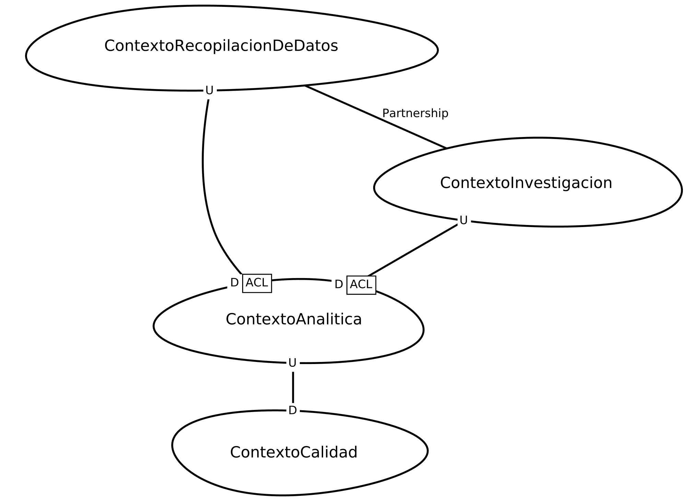
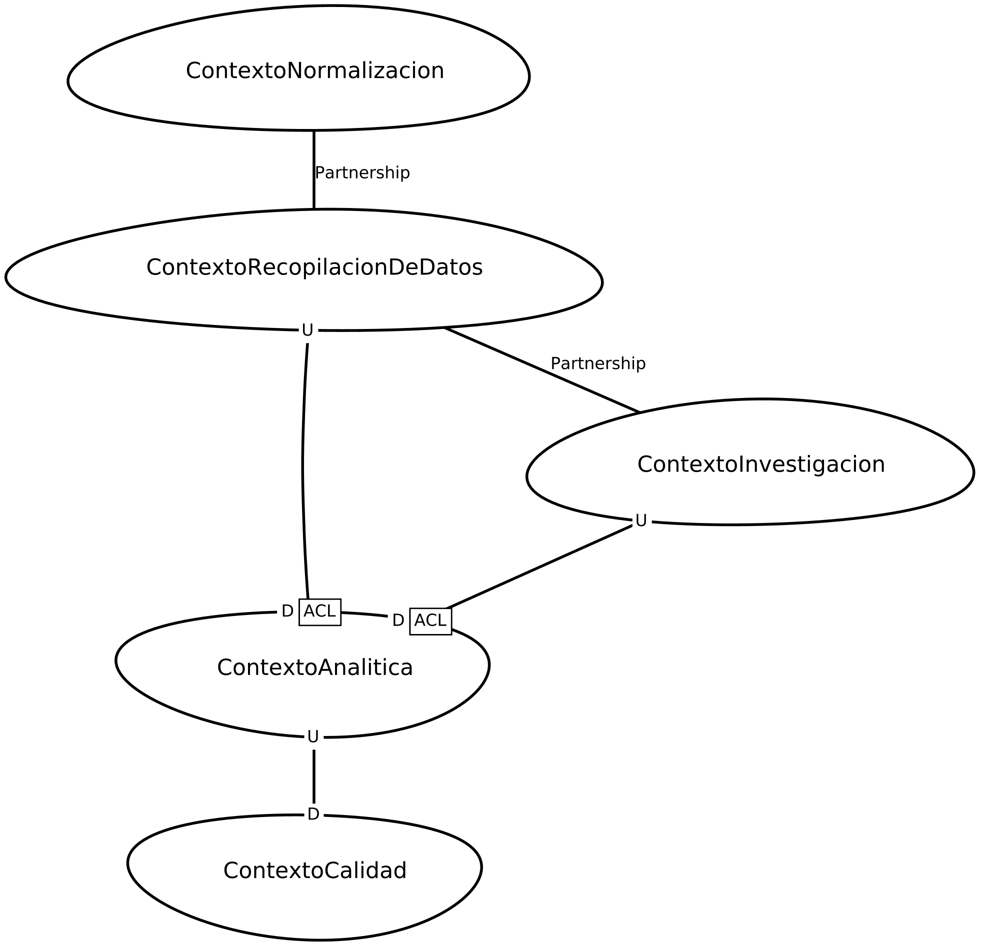

  
# DSL Examples [](https://github.com/FelipeGarcia01/context-mapper/pull/3#:~:text=Code-,Open,-add%20normalization%20context) 

This project contains PDA - DDD Context Maps written in the ContextMapper DSL.

## IDE Requirements
This is a Gradle project and can easily be imported into any IDE (ideally VS Code or Eclipse with Context Mapper installed) that supports Gradle.

### Context Mapper
In order to have language support for editing the CML files (Context Mapper Language), you need to install ContextMapper in Eclipse, Visual Studio Code, or use the online IDE Gitpod:

 * [Context Mapper for VS Code](https://marketplace.visualstudio.com/items?itemName=contextmapper.context-mapper-vscode-extension) (Marketplace)
 * [Context Mapper for Eclipse](https://marketplace.eclipse.org/content/context-mapper) (Marketplace)
   * Alternatively use this Eclipse update site URL for manual installation: 
     <br>[https://dl.bintray.com/contextmapper/context-mapping-dsl/updates/](https://dl.bintray.com/contextmapper/context-mapping-dsl/updates/)
 * [VS Code Extension in Open VSX](https://open-vsx.org/extension/contextmapper/context-mapper-vscode-extension)
   * Can be found easily in your Gitpod's.
   * Or: [Start right now by using our demo repository](https://contextmapper.org/demo/).


## PDA - Context Mapper:

### Project structure

```src/main/PDA-bounded-contxet```: this directory has all needed files to generate context mappers: 
* **domain-definition.cml** has Domain and sub-domain conteined. whit their visionStatement
* **bounded-context-definition.cml** has all bounded context definitions with their visionStatement
* **as-is-context-map.cml** has as-is context map definition on context mapper DSL.
* **to-be-context-map.cml** has to-be context map definition on context mapper DSL.

```img```: this directory has eventstorming images. 

### EventStorming: 
#### as-is: 
#### to-be: 


### AS_IS and TO_BE: 
context mapper to as_is and to_be state, is generated on ```/src-gen``` directory.

#### AS_IS


#### TO_BE



